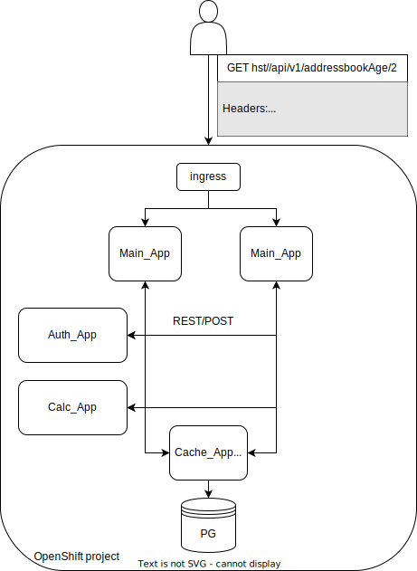

## Выпускной проект по курсу: 
#Разработка приложений для Kubernetes и OpenShift

## AddressBook

### Http requests:

### Получить запись по номеру с возрастом
`GET http://zaytsevad.apps.okd.sbc-openshift.ru/api/v1/addressbookAge/3
 login: john`

### Get in OC Cluster Запросить все записи из БД

` GET http://zaytsevad.apps.okd.sbc-openshift.ru/api/v1/addressbooks
  login: john `

## Схема приложения

